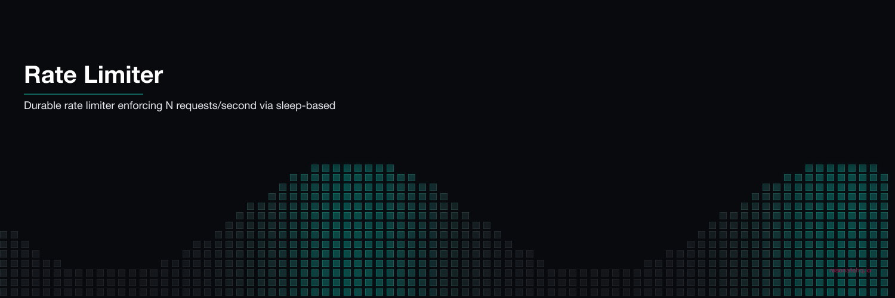

<p align="center">
  
</p>

# Rate Limiter

Durable rate-limited batch processing. Sends N API calls at a controlled rate (requests per second) using `ctx.sleep()` between calls. The rate limit is preserved across process crashes — no duplicate API calls, no burst on resume.

## What This Demonstrates

- **Durable rate limiting**: the sleep interval is a checkpoint, not just a delay
- **No duplicates on resume**: crash at call 5 → resume at call 5, not call 1
- **Crash-safe spacing**: rate window is respected even after a process restart
- **Real-world pattern**: calling OpenAI, Stripe, Twilio, or any rate-limited API in bulk

## How It Works

`ctx.sleep()` is a durable checkpoint. When the process resumes after a crash, Resonate checks whether each sleep has already elapsed:
- If yes: skip the sleep, proceed immediately
- If no: wait the remaining duration

This means the rate window is globally respected across process restarts. A 3 req/sec limit remains 3 req/sec even if the worker crashes and restarts mid-batch.

```typescript
for (let i = 0; i < requests.length; i++) {
  if (i > 0) {
    yield* ctx.sleep(intervalMs); // checkpointed — survives crashes
  }
  const response = yield* ctx.run(callExternalApi, req, crashAtId, i, requests.length);
  responses.push(response);
}
```

## Prerequisites

- [Bun](https://bun.sh) v1.0+

No external services required. Resonate runs in embedded mode.

## Setup

```bash
git clone https://github.com/resonatehq-examples/example-rate-limiter-ts
cd example-rate-limiter-ts
bun install
```

## Run It

**Happy path** — 10 requests at 3/sec (~3.3 seconds total):
```bash
bun start
```

```
=== Rate Limiter Demo ===
Mode: HAPPY PATH (10 requests at 3/sec)

[rate-limiter]  10 requests at 3/sec (333ms interval)
[rate-limiter]  Expected: ~3.0s

  [01/10] req_001 /api/v1/enrich → ok (52ms)
  [02/10] req_002 /api/v1/enrich → ok (149ms)
  [03/10] req_003 /api/v1/enrich → ok (146ms)
  [04/10] req_004 /api/v1/enrich → ok (127ms)
  [05/10] req_005 /api/v1/enrich → ok (149ms)
  [06/10] req_006 /api/v1/enrich → ok (104ms)
  [07/10] req_007 /api/v1/enrich → ok (106ms)
  [08/10] req_008 /api/v1/enrich → ok (100ms)
  [09/10] req_009 /api/v1/enrich → ok (58ms)
  [10/10] req_010 /api/v1/enrich → ok (76ms)

=== Result ===
{
  "totalRequests": 10,
  "completed": 10,
  "ratePerSec": 3,
  "wallTimeMs": 4164,
  "theoreticalMinMs": 3000
}
```

**Crash mode** — process crashes at req_005, resumes, no duplicate calls:
```bash
bun start:crash
```

```
  [01/10] req_001 /api/v1/enrich → ok (52ms)
  [02/10] req_002 /api/v1/enrich → ok (103ms)
  [03/10] req_003 /api/v1/enrich → ok (87ms)
  [04/10] req_004 /api/v1/enrich → ok (131ms)
Runtime. Function 'callExternalApi' failed with 'Error: Process crashed at req_005' (retrying in 2 secs)
  [05/10] req_005 /api/v1/enrich → ok (95ms) (retry 2)
  [06/10] req_006 /api/v1/enrich → ok (112ms)
  ...

Notice: requests 1-4 logged once (checkpointed before crash).
req_005 failed → retried → succeeded.
The rate-limit window was preserved across the crash.
```

## What to Observe

1. **Paced execution**: requests arrive at 333ms intervals. Wall time ≈ 3.3 seconds for 10 requests at 3/sec.
2. **No burst**: without rate limiting, all 10 requests would fire simultaneously. Here, each waits its turn.
3. **Crash recovery in crash mode**: req_001–004 each log once. req_005 fails and retries. req_001–004 are **not re-sent**.
4. **The rate window holds**: the retry delay (2 seconds) doesn't cause a burst after resume — each request still observes the 333ms interval.

## The Code

The workflow is 25 lines in [`src/workflow.ts`](src/workflow.ts):

```typescript
export function* rateLimitedBatch(
  ctx: Context,
  requests: ApiRequest[],
  ratePerSec: number,
  crashAtId: string | null,
) {
  const intervalMs = Math.floor(1000 / ratePerSec);
  const responses: ApiResponse[] = [];

  for (let i = 0; i < requests.length; i++) {
    if (i > 0) yield* ctx.sleep(intervalMs);
    const response = yield* ctx.run(callExternalApi, requests[i], crashAtId, i, requests.length);
    responses.push(response);
  }

  return { totalRequests: requests.length, completed: responses.length, ratePerSec, responses };
}
```

## Limitation

This is a **per-workflow** rate limiter. It enforces the rate within a single workflow execution. For distributed rate limiting across multiple workers or processes, you'd need shared state (e.g., a Redis token bucket or database semaphore). Restate's rate limiter (~392 LOC) implements a full token bucket algorithm with burst support as a virtual object shared across services.

## File Structure

```
example-rate-limiter-ts/
├── src/
│   ├── index.ts     Entry point — Resonate setup and demo runner
│   ├── workflow.ts  Rate-limited batch workflow — sleep + run loop
│   └── api.ts       Simulated external API with crash support
├── package.json
└── tsconfig.json
```

**Lines of code**: ~145 total, ~25 lines of workflow logic.

## Comparison

Restate's rate limiter ([github](https://github.com/restatedev/examples/tree/main/typescript/patterns-use-cases/src/ratelimit)) is 392 LOC implementing Go's `golang.org/x/time/rate.Limiter` as a virtual object — token bucket with burst support, cancelation, and distributed access. Hatchet and DBOS configure rate limits as infrastructure metadata.

Resonate's approach: `ctx.sleep()` for spacing. 25 LOC. Survives crashes. For most bulk API scenarios (batch enrichment, bulk emails, etc.), a sleep-based rate limiter is all you need.

| | Resonate | Restate | Hatchet |
|---|---|---|---|
| Algorithm | Sleep-based spacing | Token bucket (Go port) | Platform-configured |
| Distributed | No (single workflow) | Yes (virtual object) | Yes (server-managed) |
| Burst support | No | Yes | Yes |
| Workflow code | ~25 LOC | ~392 LOC | N/A |
| Crash-safe spacing | Yes (`ctx.sleep`) | Yes (virtual object state) | Yes |

## Learn More

- [Resonate documentation](https://docs.resonatehq.io)
- [Restate rate limit pattern](https://github.com/restatedev/examples/tree/main/typescript/patterns-use-cases/src/ratelimit)
- [Hatchet rate limiting](https://docs.hatchet.run/home/features/rate-limits)
